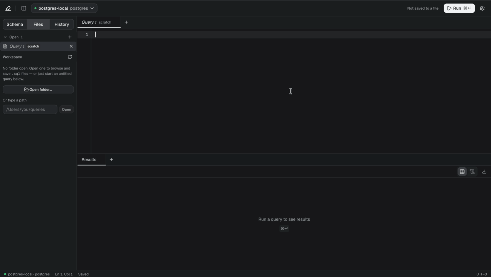
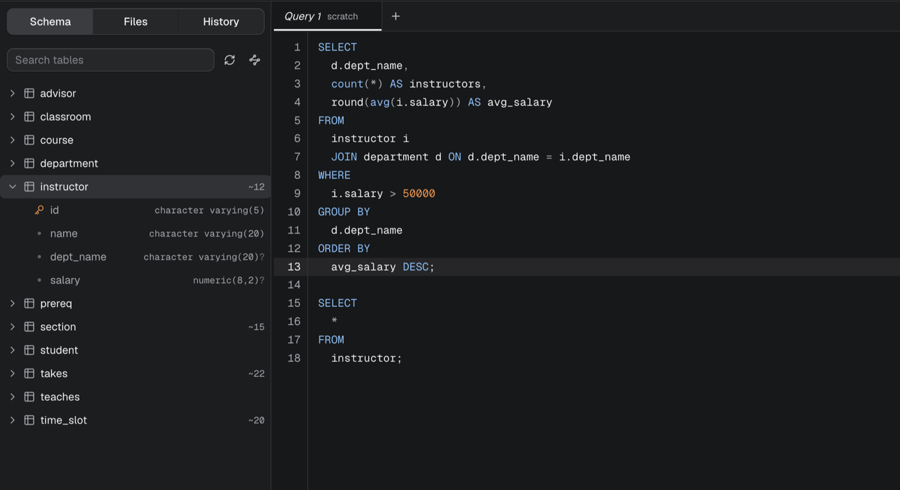
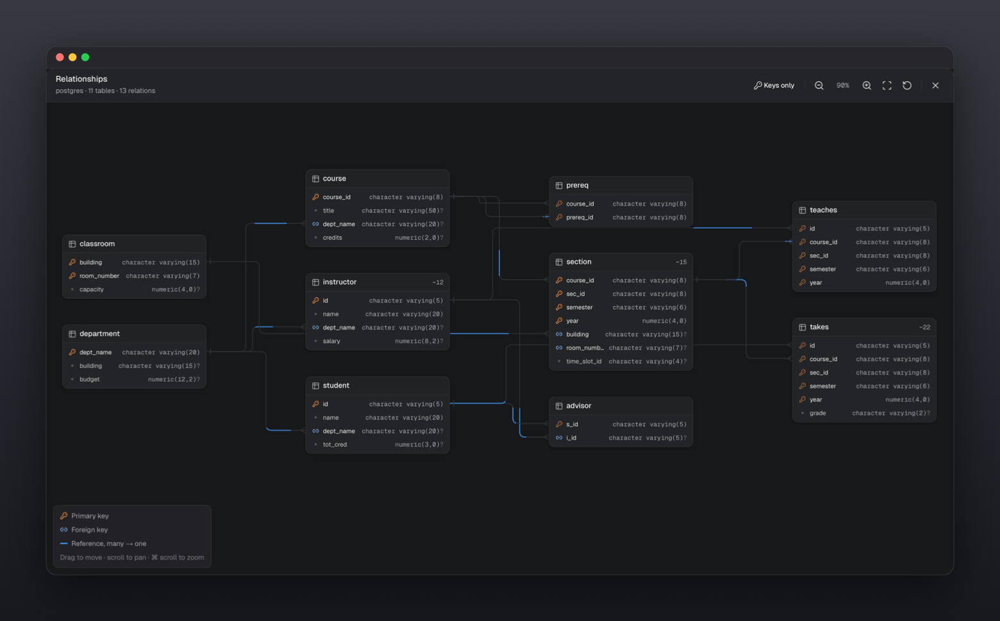
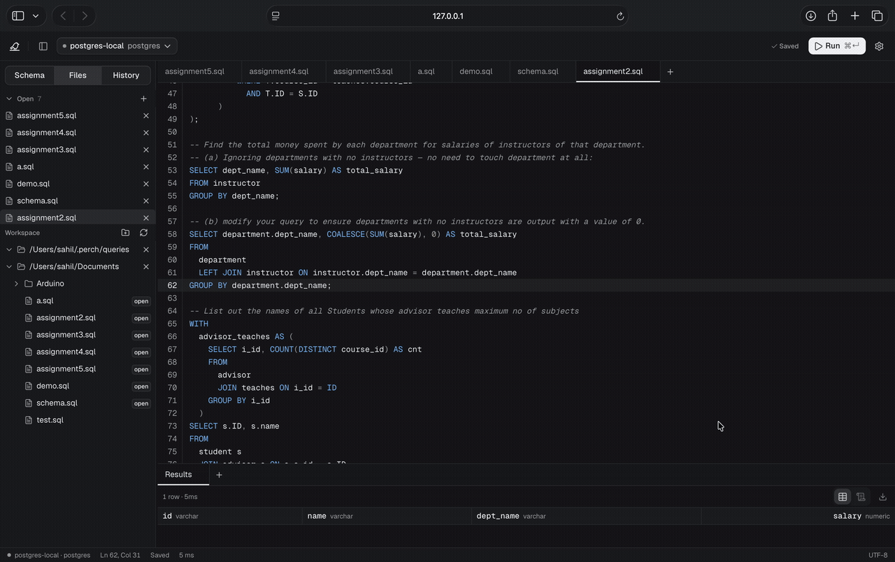
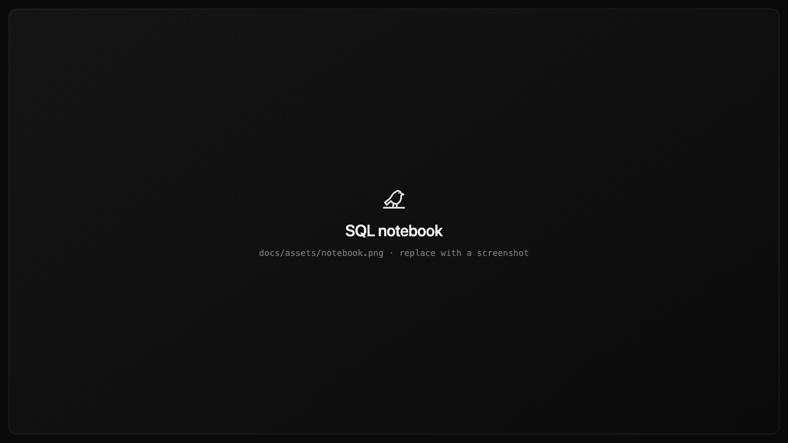
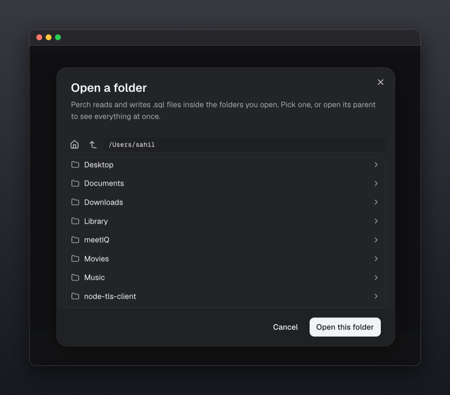
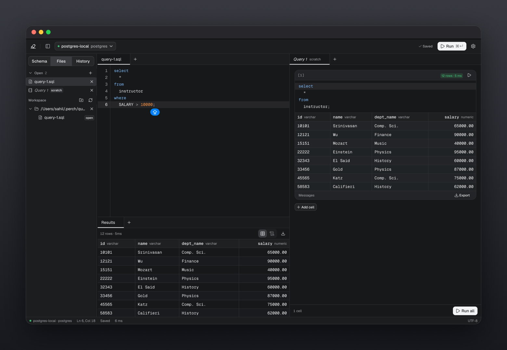
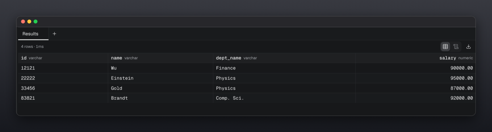
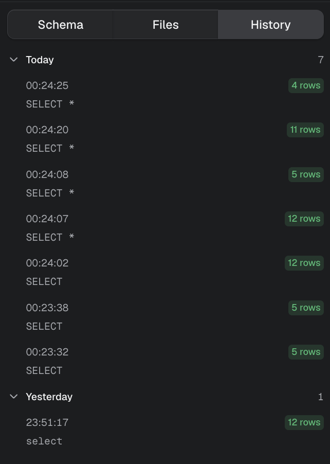
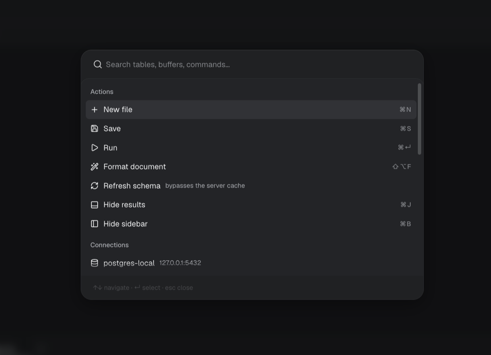

<div align="center">


# Perch

<p><strong>A lightweight SQL workspace for developers.</strong></p>

<p>
PostgreSQL · MySQL · Local-first · SQL notebooks
</p>

<p>
<a href="#install">Install</a> ·
<a href="#features">Features</a> ·
<a href="apps/server/README.md">API</a> ·
<a href="CONTRIBUTING.md">Contributing</a>
</p>


</div>

<br>

<p align="center">
  
</p>

## What is Perch?

Perch is a lightweight SQL workspace for developers who spend their time **writing, exploring, and understanding SQL**.

It brings schema exploration, SQL editing, query execution, results, and database visualization into one focused workspace.

Perch works with PostgreSQL and MySQL databases already running on your machine. Your SQL files stay on disk as normal `.sql` files, while Perch provides the tools around them.

**No account. No cloud service. No bundled database.**

Perch ships as a single self-contained binary — around 14 MB, with no runtime to install
alongside it.

## Features

### Schema-aware SQL editor

Write SQL with your database schema directly in context.

The schema sidebar shows tables, views, materialized views, columns, types, nullability, primary keys, and row estimates. The editor uses the same metadata for completions and dialect-aware syntax highlighting.

Database errors are mapped back to the exact location in your query.

<p align="center">
  
</p>

Run the statement under your cursor with <kbd>⌘</kbd><kbd>↵</kbd>, or the entire file with <kbd>⌘</kbd><kbd>⇧</kbd><kbd>↵</kbd>.

---

### Relationship View

**See how your database fits together.**

Relationship View turns foreign-key relationships into an interactive schema diagram. Tables show their columns and keys, while relationships are drawn between the tables they connect.

Click to focus on a table, drag to rearrange the layout, and zoom or pan around larger schemas.

<p align="center">
  
</p>

Large tables automatically switch to a compact keys-only view, keeping the diagram readable.

---

### Query Walk

**See how a SQL query produces its result.**

Query Walk visualizes a `SELECT` step by step through its major stages:

```text
FROM → JOIN → WHERE → GROUP BY → HAVING
→ WINDOW → SELECT → DISTINCT → ORDER BY → LIMIT
```

At each stage, Perch shows the rows returned by your database and explains what happened.

This makes complex SQL easier to understand, debug, and explain — especially joins, filtering, aggregation, window functions, subqueries, `CASE`, and set operations.

<p align="center">
  
</p>

The visualization is based on your actual SQL and database. Query Walk uses read-only executions and does not modify your data.

---

### SQL notebooks

Turn any `.sql` file into a notebook.

Each statement can run independently while keeping its own results, row count, and execution time.

```sql
-- Query 1
SELECT *
FROM orders
WHERE status = 'paid'
LIMIT 20;

-- %%

-- Query 2
SELECT *
FROM orders
WHERE status = 'paid'
  AND created_at > now() - interval '7 days';
```

The file remains valid SQL and can still be used outside Perch.

<p align="center">
  
</p>

---

### Workspace folders

Open a directory and work directly with the `.sql` files inside it.

There is no import step or proprietary project format.

- Files open and save in place
- External changes are detected
- Multiple folders can be open
- Tabs and focus are restored between sessions
- Autosave is configurable
- Untitled queries can be saved into a workspace

<p align="center">
  
</p>

---

### Split panes

Compare queries and results side by side using a resizable pane layout.

Drag tabs to any edge to create splits, move tabs between panes, and restore the layout when you return.

<p align="center">
  
</p>

---

### Result grid

Inspect query results in a fast, virtualized grid.

- Typed column headers
- Row counts and execution time
- Distinct `NULL` representation
- Grid and text views
- CSV export
- Clipboard copying
- Separate result tabs for multi-statement queries
- Server messages and notices

<p align="center">
  
</p>

---

### Query history

Every query you run is stored in local history.

History survives restarts and records the SQL, outcome, row count, and execution time.

**Result rows are never stored in history.**

<p align="center">
  
</p>

---

### Command palette

Press <kbd>⌘</kbd><kbd>K</kbd> to search Perch without leaving the keyboard.

Search across:

- Commands
- Open files
- Connections
- Databases
- Tables

Switching connections or databases automatically updates the schema and editor context.

<p align="center">
  
</p>

## Install

### macOS and Linux

```sh
curl -fsSL https://raw.githubusercontent.com/Sahil1337/perch/main/install.sh | sh
```

This fetches the latest release for your platform, verifies its checksum, and installs `perch`
into `/usr/local/bin` — or `~/.local/bin` if that is not writable. Then:

```sh
perch          # starts the server and opens the UI
perch status   # is it running, and where
perch stop     # stop it
```

The installer takes `PERCH_VERSION=v0.1.0` to pin a release and `PERCH_INSTALL_DIR=~/bin` to
choose where it lands.

### Windows

Download `perch-<version>-windows-amd64.exe` from the
[releases page](https://github.com/Sahil1337/perch/releases/latest) and run it. Windows shows a
SmartScreen warning the first time — choose **More info → Run anyway**.

### From source

Needs Go 1.25+ and Bun. See [`CONTRIBUTING.md`](CONTRIBUTING.md).

### If macOS refuses to open it

Perch's binaries are not notarized yet. The `curl` install above avoids this entirely, because
macOS only quarantines files a *browser* downloaded. If you took the binary from the releases
page instead and macOS says the developer cannot be verified:

```sh
xattr -d com.apple.quarantine ./perch
```

## Getting started

On first launch, choose a workspace, connection, and database.

Perch can discover database servers already running on your machine, including PostgreSQL and MySQL installations exposed through local ports, binaries on `PATH`, Homebrew, systemd, Windows services, and Docker.

Perch never installs or bundles a database server.

## Keyboard shortcuts

| Shortcut                             | Action                    |
| ------------------------------------ | ------------------------- |
| <kbd>⌘</kbd><kbd>↵</kbd>             | Run selection / statement |
| <kbd>⌘</kbd><kbd>⇧</kbd><kbd>↵</kbd> | Run entire file           |
| <kbd>⌘</kbd><kbd>K</kbd>             | Command palette           |
| <kbd>⌘</kbd><kbd>B</kbd>             | Toggle sidebar            |
| <kbd>⌘</kbd><kbd>J</kbd>             | Toggle results            |
| <kbd>⌘</kbd><kbd>S</kbd>             | Save                      |
| <kbd>⌘</kbd><kbd>&#92;</kbd>         | Split pane                |
| <kbd>⌘</kbd><kbd>,</kbd>             | Settings                  |
| <kbd>⇧</kbd><kbd>⌥</kbd><kbd>F</kbd> | Format SQL                |

Use <kbd>Ctrl</kbd> instead of <kbd>⌘</kbd> on Windows and Linux.

## Local-first

Perch runs locally and keeps your workspace on your machine.

```text
~/.perch/
├── connections.json
├── settings.json
├── history.jsonl
├── server.json
└── queries/
```

`PERCH_HOME` can be used to relocate this directory.

Perch sends no telemetry and does not require a remote service for normal operation.

## Contributing

Perch is a Bun workspace monorepo. The server and CLI are Go; the UI and the shared packages are
TypeScript.

See [`CONTRIBUTING.md`](CONTRIBUTING.md) for development setup, project structure, scripts, and verification.

Bug reports and feature requests: [GitHub Issues](https://github.com/Sahil1337/perch/issues).

## License

MIT © Sahil1337
